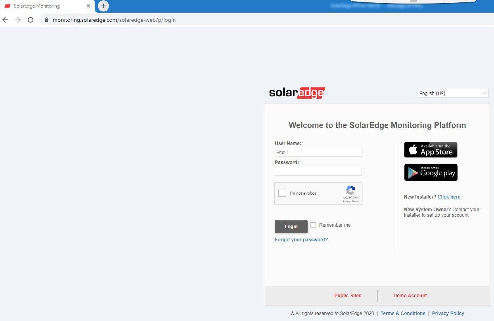
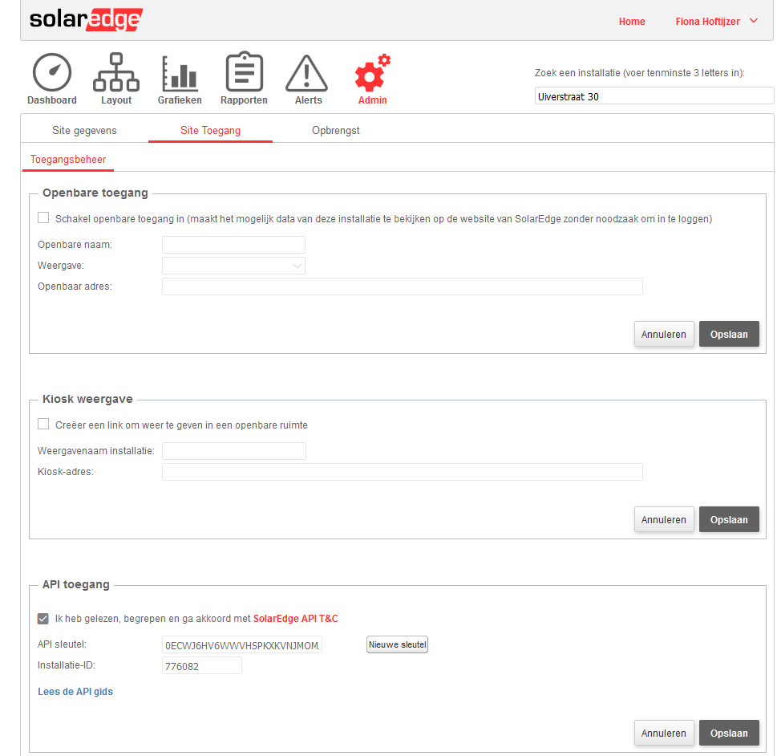
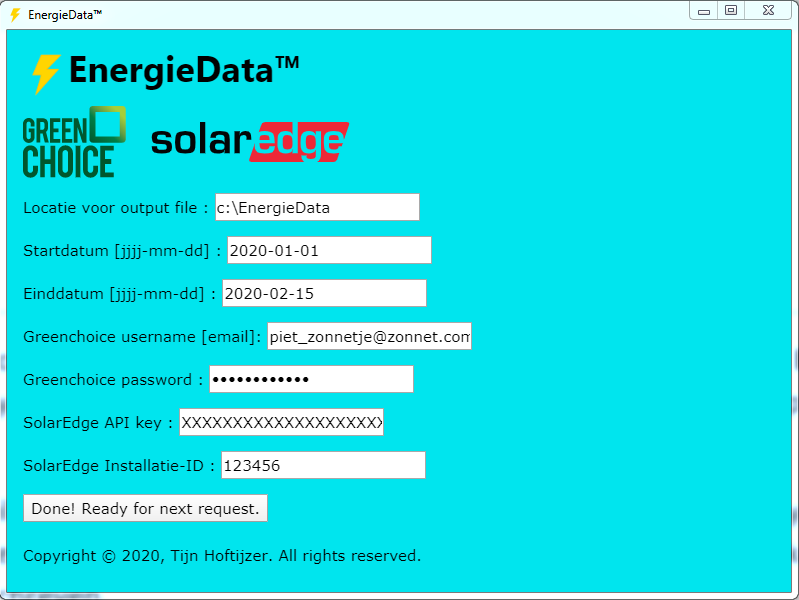
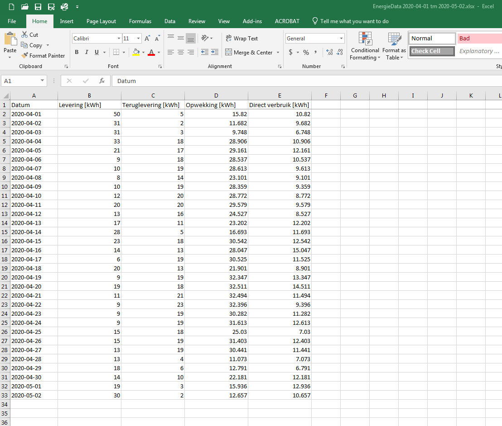
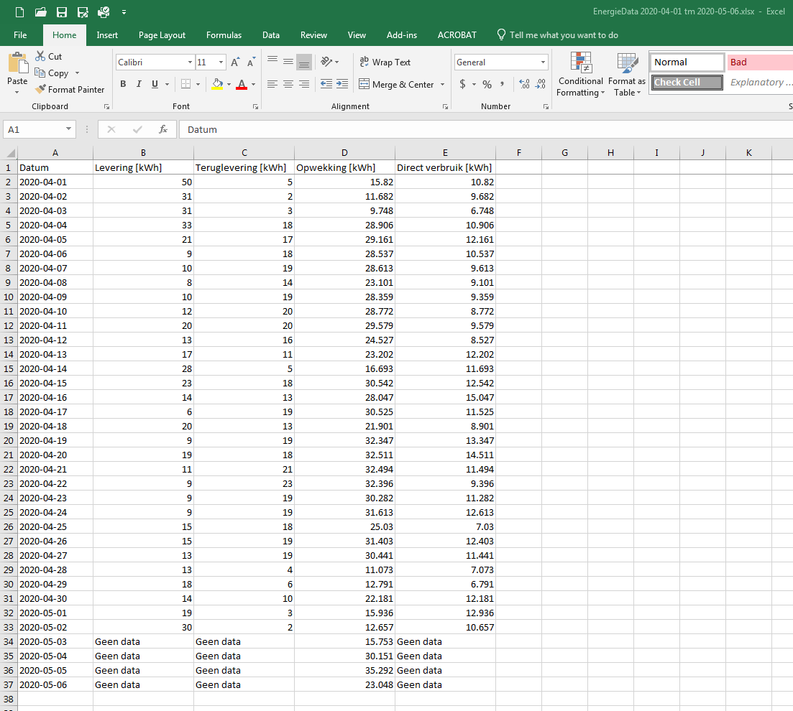
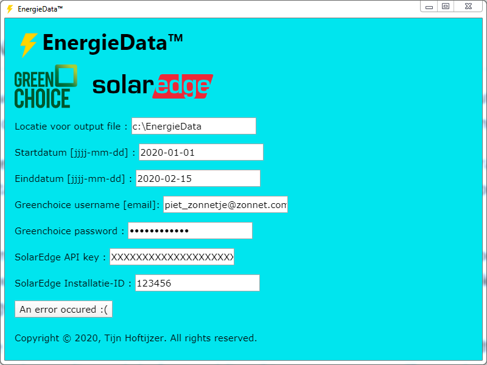
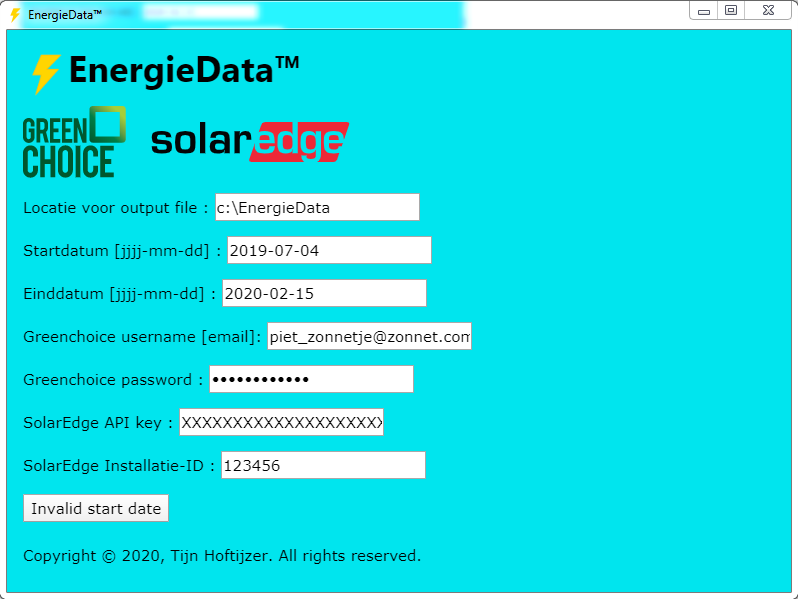

# Untitled

\*\*\*\***ENERGIEDATA™**

## VOORBEREIDING

GREENCHOICE

Zorg dat u toegang heeft tot de online omgeving van Greenchoice en/of de Greenchoice app. Voor

**EnergieData™** gebruikt u dezelfde username en password.

SOLAREDGE

Ga naar de SolarEdge Monitoring site: [monitoring.solaredge.com/solaredge-web/p/login](http://monitoring.solaredge.com/solaredge-web/p/login) en log in \([Figure 1]()\).

_Figure 1: SolarEdge login scherm_

Klik op “Admin” en daarna op “Site Toegang”. Ga akkoord met de voorwaarden bij “API Toegang” \([Figure 3]()\). Noteer de API sleutel en Installatie-ID want deze heeft u nodig voor **EnergieData™**. Klik op “Opslaan”. U kunt nu uitloggen.

**Piet Zonnetje**

Energiestraat 123

xxxxxxxxxxxxxxxxxxxxxxxxxxx

xxxxxx

_Figure 2: SolarEdge admin scherm_

## INSTALLATIE

Download de laatste release van de **EnergieData™** installer voor uw besturingssysteem. Start de installer en voer alle stappen uit \(klik op “Ja” als om administrator toegang wordt gevraagd\).

**EnergieData™** is nu geinstalleerd.

## GEBRUIK

Start **EnergieData™**, voer de gevraagde gegevens in en klik op “Download!”. Zodra **EnergieData™** aangeeft “Done! Ready for next request.” is er een Excel output file gegenereerd op de door u opgegeven locatie \([Figure 3]()\).

_Figure 3: Excel output file succesvol gegenereerd_

Er kunnen zo vaak u wil nieuwe output files worden gemaakt door op “Done! Ready for next request.” te klikken. Als hierbij dezelfde start- en einddatum worden opgegeven als een vorige keer, wordt de vorige Excel output file overschreven.

De opgegeven file-locatie en alle login-gegevens worden bewaard zodra u op de download-knop drukt. Deze gegevens blijven bewaard als u het programma afsluit en zijn weer zichtbaar als u **EnergieData™** opnieuw start.

## EXCEL OUTPUT FILE

De Excel output file heeft de volgende 5 kolommen \([Figure 4]()\):

* Datum
* Levering Door Greenchoice aan u geleverde stroom in kWh
* Teruglevering Door u aan Greenchoice teruggeleverde stroom in kWh
* Opwekking Door u opgewekte stroom in kWh
* Direct verbruik Direct verbruikte opgewekte stroom \(=Opwekking-Teruglevering\)

_Figure 4: Excel output file_

Als er voor een bepaalde datum nog geen Greenchoice data beschikbaar is \(maar wel SolarEdge data\) verschijnt voor die datum in de output file “Geen data” in de kolommen Levering, Teruglevering en Direct verbruik \([Figure 5]()\). In de Greenchoice app wordt voor die datum een geschat verbruik en teruglevering weergegeven.

_Figure 5: Excel output file: “Geen data”_

## FOUTMELDINGEN

Als de login-gegevens voor Greenchoice en/of SolarEdge niet correct zijn, zal de foutmelding “An error occurred” verschijnen op de download-knop \([Figure 6]()\). Er zal geen output file worden gegenereerd.

_Figure 6: Foutmelding “An error occurred”_

Als de door u opgegeven startdatum voor de startdatum van uw Greenchoice contract ligt, zal de foutmelding “Invalid start date” verschijnen op de download-knop \([Figure 7]()\). Er zal geen output file worden gegenereerd.

_Figure 7: Foutmelding “Invalid start date”_

Als de SolarEdge data niet beschikbaar is of de door u opgegeven startdatum ligt voor het vorige kalender jaar, zal de foutmelding “An error occurred” verschijnen op de download-[knop \(Figure 6]()\). Er zal geen output file worden gegenereerd.

Als een niet bestaande datum wordt opgegeven, niet het juiste datum format wordt gebruikt of de einddatum voor de startdatum ligt, zal de foutmelding “An error occurred” verschijnen op de download- knop \([Figure 6]()\). Er zal geen output file worden gegenereerd.

